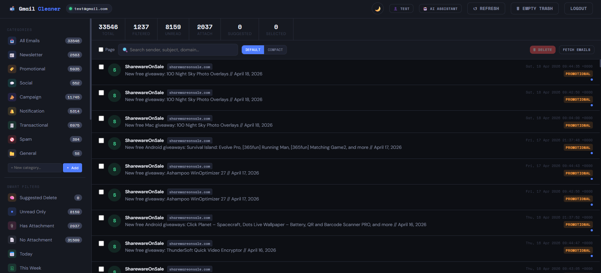
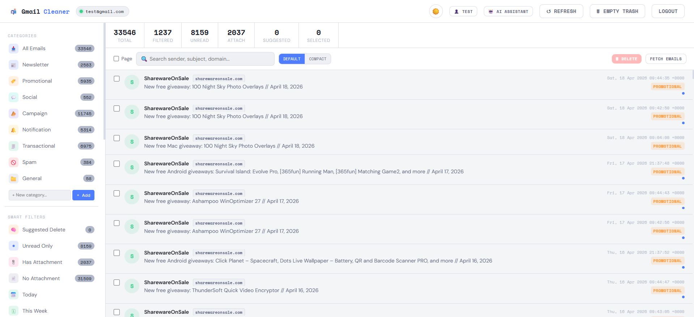
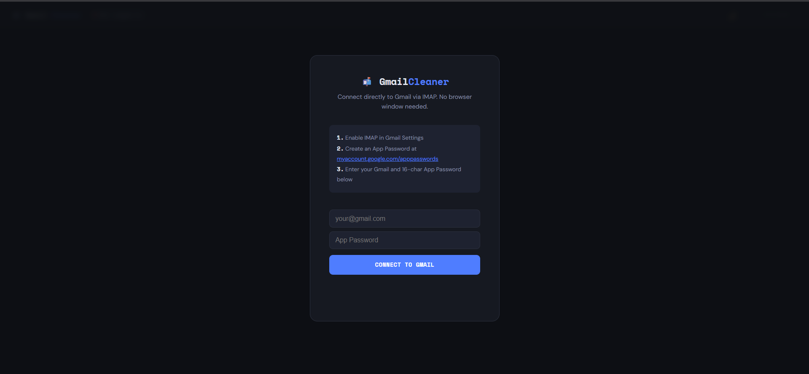
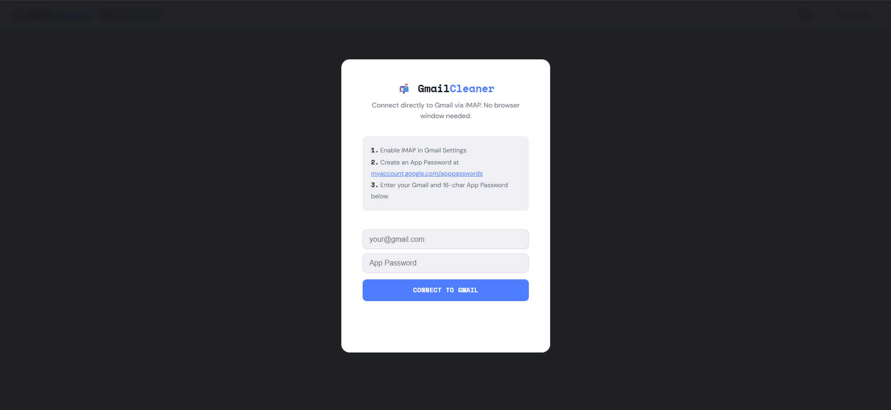

# 📬 GmailCleaner

A self-hosted Gmail cleaning tool built entirely in Go with **zero external dependencies**. Connect via IMAP, browse your inbox with AI-powered categorization, bulk-delete junk, manage tags, and switch between multiple accounts — all from a sleek single-page web UI.

---
## 🖼️ Screenshots

**Landing Page**

**Black Theme**


**White Theme**


**Login Page**

**Black Theme**


**White Theme**



---

## ✨ Features

### Core
- **Direct IMAP connection** — connects to Gmail over TLS (`imap.gmail.com:993`), no OAuth or browser automation needed
- **Bulk email management** — select, search, filter, and mass-delete emails
- **Empty Trash** — one-click permanent trash purge via IMAP EXPUNGE
- **Rich email viewer** — read emails in a modal with full HTML rendering via sandboxed iframe, with plain-text fallback
- **Attachment detection** — emails with attachments are flagged via IMAP BODYSTRUCTURE parsing

### Smart Categorization
- **Auto-categorize** — emails are classified into Newsletter, Promotional, Social, Spam, Transactional, Notification, Campaign, and General
- **Keyword + AI hybrid** — rule-based keyword matching enriched by a pure-Go **Naive Bayes classifier** (no external AI services)
- **Custom categories** — create your own categories and move emails between them
- **Domain-based grouping** — see email counts per sender domain with sorting options

### AI Assistant
- **Built-in Q&A** — ask natural-language questions about your inbox ("who sends me the most email?", "show spam stats", etc.)
- **Smart suggestions** — AI-generated cleanup suggestions based on deletion patterns
- **Learns from you** — the classifier retrains on every delete action to improve future suggestions

### Tags & Organization
- **Tag system** — tag emails as Important, Keep, Spam, or any custom tag
- **Bulk tagging** — apply/remove tags from multiple selected emails at once
- **Tag filters** — filter sidebar by tag to quickly find tagged emails
- **Inline creation** — create new tags and categories directly from the sidebar

### Multi-Account & Profiles
- **Multiple Gmail accounts** — add, switch, and remove accounts
- **Per-user profile directories** — each account gets its own isolated data folder (`browser_data/profiles/<email>/`)
- **Auto-login** — saved accounts appear on the login screen for one-click re-login
- **Shared accounts list** — `accounts.json` persists across sessions; credentials stay saved after logout

### UI & Theming
- **Dark & Light themes** — toggle between dark and light mode; preference saved in localStorage
- **Responsive SPA** — single HTML file, no build step, no npm
- **Label + Domain groups** — combined Gmail label and domain grouping with category color dots
- **Compact/Default view** — toggle email list density
- **Real-time progress** — live progress bar and status updates during fetch/delete operations

---

## 🚀 Quick Start

### Prerequisites
- **Go 1.22+** installed ([download](https://go.dev/dl/))
- A Gmail account with:
  1. **IMAP enabled** — Gmail Settings → See all settings → Forwarding and POP/IMAP → Enable IMAP
  2. **App Password** — [Create one here](https://myaccount.google.com/apppasswords) (requires 2FA enabled)

### Run

```bash
# Clone the repo
git clone https://github.com/rahul1996pp/GmailCleaner.git
cd gmailcleaner-go

# Run directly
go run .

# Or build and run
go build -o gmailcleaner .
./gmailcleaner
```

Open **http://localhost:8000** in your browser.

### Login
1. Enter your Gmail address
2. Enter your 16-character App Password
3. Click **Connect to Gmail**

The app fetches your latest emails over IMAP and caches them locally.

---

## 📁 Project Structure

```
.
├── main.go              # HTTP server, route handlers, entry point
├── imap.go              # IMAP connection, email fetch/parse/cache, profile paths
├── categorizer.go       # Email categorization (keyword rules + AI enrichment)
├── localai.go           # Pure-Go Naive Bayes classifier + rule-based Q&A
├── smartclean.go        # Deletion tracking, ML scoring, label+domain groups
├── usertags.go          # Tag system, custom categories, category overrides
├── accounts.go          # Multi-account management, profile switching
├── gmailcleaner_test.go # Unit tests
├── go.mod               # Go module (zero dependencies)
├── static/
│   └── index.html       # Full SPA frontend (HTML + CSS + JS)
└── browser_data/        # Runtime data (auto-created)
    ├── accounts.json    # Shared accounts list
    └── profiles/
        └── user_at_gmail.com/
            ├── imap_creds.json
            ├── email_cache.json
            ├── domain_cats.json
            ├── user_tags.json
            └── delete_history.json
```

---

## 🔌 API Endpoints

| Method | Endpoint | Description |
|--------|----------|-------------|
| `GET` | `/api/status` | Connection status, login state, accounts list |
| `POST` | `/api/login` | Login with email + app password |
| `POST` | `/api/logout` | Logout (preserves saved credentials) |
| `GET` | `/api/emails` | Fetch cached emails (`?refresh=true` to re-fetch from IMAP) |
| `GET` | `/api/emails/status` | Fetch progress (during IMAP sync) |
| `GET` | `/api/email_body?id=N` | Get full body of a specific email |
| `POST` | `/api/delete` | Delete emails by ID list |
| `GET` | `/api/stats` | Inbox statistics |
| `POST` | `/api/ask` | Ask the AI assistant a question |
| `GET` | `/api/suggestions` | Get AI cleanup suggestions |
| `GET` | `/api/label_domain_groups` | Label + domain groupings |
| `GET` | `/api/delete_history` | Deletion history |
| `POST` | `/api/empty_trash` | Permanently empty Gmail trash |
| `GET` | `/api/tags` | Get all tags and email-tag mappings |
| `POST` | `/api/tags` | Set tags for an email |
| `POST` | `/api/tags/create` | Create a custom tag |
| `GET` | `/api/categories` | Get category list + custom categories |
| `POST` | `/api/categories/create` | Create a custom category |
| `POST` | `/api/categories/move` | Move emails to a different category |
| `GET` | `/api/accounts` | List all saved accounts |
| `POST` | `/api/accounts/add` | Add and verify a new account |
| `POST` | `/api/accounts/switch` | Switch active account |
| `POST` | `/api/accounts/remove` | Remove a saved account |
| `POST` | `/api/accounts/autologin` | Auto-login with saved credentials |

---

## 🎨 Themes

Toggle between **Dark** and **Light** mode using the moon/sun button in the header. Your preference is saved in `localStorage` and persists across sessions.

| Dark Mode | Light Mode |
|-----------|------------|
| Deep navy background | Clean white background |
| Easy on the eyes at night | Clear readability in daylight |

---

## 🔒 Security Notes

- **Credentials are stored locally** in `browser_data/` — never sent to any external service
- **Direct IMAP/TLS** connection to Gmail servers — no middleman proxy
- **App Passwords** are scoped tokens — they don't expose your main Google password
- **No external dependencies** — the entire app is pure Go stdlib, reducing supply-chain risk
- All data stays on your machine. Nothing is uploaded anywhere.

---

## 🧪 Testing

```bash
go test ./...
go vet ./...
```

---

## 🤖 How the AI Works

GmailCleaner includes a **pure-Go Naive Bayes text classifier** — no Ollama, no OpenAI, no external services.

1. **Training** — the classifier learns from your email subjects and sender patterns
2. **Categorization** — new emails are classified using keyword rules first, then AI enrichment for uncertain cases
3. **Continuous learning** — every time you delete emails, the model retrains to better identify junk
4. **Q&A engine** — pattern-matched natural language queries with statistical answers from your inbox data

---

## 📧 Email Body Rendering

GmailCleaner properly handles the full complexity of email MIME:

- **MIME multipart** — walks `multipart/mixed`, `multipart/alternative`, and nested structures to find `text/html` and `text/plain` parts
- **Transfer encoding** — decodes Base64 and Quoted-Printable content automatically
- **HTML rendering** — HTML emails are displayed in a sandboxed `<iframe>` with auto-height adjustment for a native reading experience
- **Plain-text fallback** — if no HTML part exists, plain text is shown; if only HTML exists, a stripped plain-text version is also generated
- **Attachment detection** — `BODYSTRUCTURE` is requested during header fetch to reliably detect `Content-Disposition: attachment`

---

## 📋 Configuration

No config files needed. The app auto-creates its data directory next to the binary:

| Setting | Default | Details |
|---------|---------|---------|
| Port | `8000` | Hardcoded in `main.go` |
| IMAP Server | `imap.gmail.com:993` | TLS connection |
| Data Directory | `./browser_data/` | Auto-created on first run |
| Profile Directory | `./browser_data/profiles/<email>/` | Per-account isolation |

---

## 🛣️ Roadmap

- [ ] IMAP IDLE for real-time email notifications
- [ ] Export/import email lists (CSV)
- [ ] Scheduled auto-cleanup rules
- [ ] Docker container support
- [ ] Support for non-Gmail IMAP servers

---

## 📄 License

See [LICENSE](LICENSE) for details.

---

